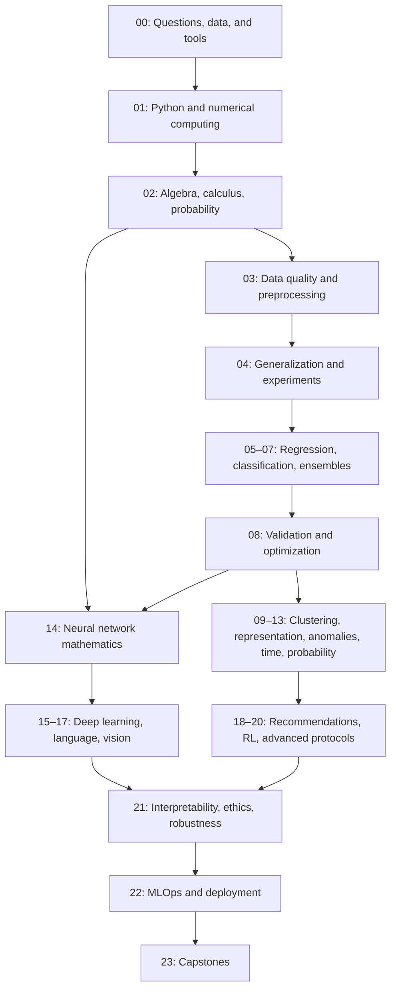

# Learning roadmap

The eight-lesson introductory route builds orientation and confidence. It deliberately previews NumPy, tables, and derivatives before the complete foundation sequences. After it, fill the remaining lessons in modules 01 and 02; a preview is not a substitute for practice with loops, functions, algebra, probability, or calculus.

## Prerequisite gates

| Before studying | Demonstrate first |
|---|---|
| Regression | Interpret array shapes; solve a linear equation; calculate a mean, residual, square, and derivative |
| Logistic regression | Explain probability, logarithms, linear predictors, and train/test separation |
| KNN and clustering | Calculate distances; explain how changing units affects them |
| Trees and ensembles | Explain a split, class counts, training loss, and overfitting |
| Cross-validation | Fit preprocessing only on training data; distinguish tuning from final assessment |
| PCA | Center columns; calculate matrix products; interpret variance and eigenvectors |
| Time series | Preserve chronological information; identify the prediction horizon |
| Neural networks | Apply the chain rule and derive a gradient update before importing PyTorch training tools |
| NLP and vision | Trace tensor shapes and choose task-appropriate validation |
| Reinforcement learning | Compute conditional probabilities and expected sums of rewards |
| Deployment | Explain input schema, held-out evidence, artifact provenance, and model limitations |

The inventory stores a navigable prerequisite graph. Module gates above add broader readiness criteria: completing a single linked predecessor is not proof of mastery of an entire mathematical foundation.

## Classical ML priority route

After the foundation gates, study linear regression and gradient descent in depth, followed by logistic regression, KNN, Naive Bayes, decision trees, random forests, SVMs, and boosting. Interleave evaluation and preprocessing instead of treating them as end-of-course cleanup. Then study K-Means, PCA, and DBSCAN before less common variants.

## Exit criteria

For each major algorithm, explain why it exists, which values training estimates, what prediction computes, how hyperparameters affect behavior, and when it fails. Reproduce one calculation by hand, implement its core operation, compare with a library, and evaluate held-out behavior. If you can only call `.fit`, revisit the mechanism.

The [syllabus](SYLLABUS.md) contains every planned lesson. The [progress ledger](PROGRESS.md) tells you which are currently available. Advanced paths remain planned until their notebook files and execution evidence exist.
