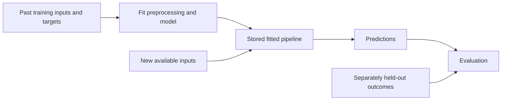

# Concept diagrams

## Information flow in supervised learning

The held-out outcomes are used to assess predictions after the model is fixed. Sending them into fitting would contaminate that assessment. Validation outcomes may guide choices, but the final test outcomes should remain separate from that iterative process.

## Array shapes in a weighted prediction

`X: (n, p)` × `w: (p,)` → `predictions: (n,)`

There are n examples and p features. Each row pairs with the same ordered weights. Shape compatibility is necessary but not sufficient: feature meaning and units must also agree. See the [matrix lesson](../02_Mathematics_for_ML/07_scalars_vectors_and_matrices.ipynb).
